This tutorial is a detailed guide on creating a shader using ray tracing techniques to render a 3D scene. It is designed for those interested in computer graphics and shader programming, providing a step-by-step approach to building a complex visual effect. The tutorial begins with the basics of ray generation, explaining how to create rays from a camera's position and transform them to align with the camera's view direction using a rotation matrix.

As the tutorial progresses, it delves into rendering various elements of the scene, such as a background with a gradient, a plane with lighting effects, and an axis-aligned box with smooth edges and soft shadows. These sections cover essential concepts like lighting models, color gradients, and intersection calculations, providing code snippets and explanations to help readers understand the implementation.

The tutorial also explores advanced topics, including creating water-like noise for surface reflections, implementing normal mapping, and calculating surface reflections using Fresnel equations. Additionally, it covers rendering the inside of the box with a cosmic theme, featuring stars and a nebula created using ray marching and 3D noise. Throughout the guide, visual examples and links to further resources are provided to enhance understanding and encourage further exploration in the field of shader development.


### 1. Basic setup

For our shader, we are going to use ray tracing to render the scene. First we need to generate our rays. A ray has an origin and a direction. The origin will be our the position of our camera. From the origin, we will shoot shoot one ray per pixel in the camera's view direction.  
Before shooting a ray from the camera's position, we generate ray direction in the following manner:

```glsl
vec3 rd = vec3( ( fragCoord * 2.0 - iResolution.xy ) / iResolution.x, 0.7 );
```

We shift the fragment's screen space position to be centered at the  origin([ 0.0, 0.0 ]) and then normalize it by the width of the screen. This way we are going to have uniform speed across both the X and Y axes when we move our camera. Z value defines FOV of the camera - the larger it is, the more zoomed-in the view will be. Thus, for each pixel, we obtain a vector that specifies that ray direction for the pixel.

The rays need to be transformed to align with camera's view direction. We are going to create a rotation matrix that will transform rays defined in wolrd coordinates to rays defined in camera coordinates:

```glsl
// Orthonormal vectors of the view transformation
vec3 vz = normalize( view_dir );
vec3 vy = normalize( up );
vec3 vx = normalize( cross( vz, vy ) );
vy = normalize( cross( vx, vz ) );
mat3 m = mat3( vx, vy, vz );
```

The camera is defined by its `view direction` and `up` vector. The camera's coordinate system is then defined as follows: the Z axis points in the `view direction`, the X axis is perpendicular to both the `up` and `view direction` vectors, and the Y axis is perpendicular to both the X and Z axes. We normalize all vectors and pack them into a matrix - this will be our rotation matrix.   

Now we apply the camera's rotation to our rays:

```glsl
rd = normalize( m * rd );
```

Here are a few resources to help with understanding the topic:
- [Fundamentals of Computer Graphics]
- [Confused with Coordinate Transformations] 
- [Computer Graphics Chapter – 7 (part - B)]

### 2. Background

We define a seperate function to draw background:
```glsl
vec3 draw_background
(
  in vec3 ro,
  in vec3 rd
)
{
  vec3 final_color = vec3( 0.0 );

  // ...

  return final_color;
}
```

#### 2.1. Color

The color will be a symmetrical gradient in the Y direction, starting at 0.0 and ending at 1.0. We smooth out the Y value for a softer transition.
```glsl
vec3 bgcol( in vec3 rd )
{
  return mix
  ( 
    vec3( 0.01 ), 
    vec3( 0.336, 0.458, 0.668 ), 
    smoothstep( 1.0, 0.0, abs( rd.y ) ) 
  );
}
```

#### 2.2. Plane

A plane is defined by its normal and any point on the plane. To prevent it from extending to infinity, we will constrain it within the range [ -12.0, 12.0 ]:
```glsl
float plane_size = 12.0;
vec3 plane_normal = vec3( 0.0, 1.0, 0.0 ); // Normal of the plane
vec3 p0 = PLANE_P; // Any point on the plane
```
To draw a plane, we need to find the point of intersection between our ray and the plane. The formula can be derived analytically and translated directly to the code:

```glsl
float raytrace_plane
( 
  in vec3 ro, // Ray origin
  in vec3 rd, // Ray direction
  in vec3 normal, // Normal of the plane
  in vec3 p0 // Any point on the plane
)
{
  // If this equals 0.0, then the line is parallel to the plane
  float RdotN = dot( rd, normal );
  if( RdotN == 0.0 ) { return -1.0; }

  float t = dot( ( p0 - ro ), normal ) / RdotN;
  return t;
}
```
Links:
- [Line-plane intersection]
- [Intersectors]

Then we call it like this:
```glsl
float plane_t = raytrace_plane( ro, rd, plane_normal, p0 ); // Distance to the plane
```

If `plane_t` is greater than, then we have a hit in a the positive direction of our ray.

```glsl
float plane_t = raytrace_plane( ro, rd, plane_normal, p0 );

if( plane_t > 0.0 )
{
  vec3 plane_hit = ro + plane_t * rd;
  vec2 uv = abs( plane_hit.xz )
  if all( uv <= vec2f( plane_size ) )
  {
    // Color the plane
    // ...
  }
}
```

For a better appearance, we will define a `blur_radius` and smoothly blend the color of the plane with black ( no color ) to create a nice circular area:
```glsl
float blur_radius = 10.0;

// ...

if all( uv <= vec2f( plane_size ) )
{
  vec3 plane_color = vec3( 1.0 );
  final_color = mix
  ( 
    plane_color, 
    final_color, 
    smoothstep
    ( 
      blur_radius - 1.5,
      blur_radius,
      length( uv )
    ) 
  );
}
```
#### 2.3. Lighting

The light will be a point light whose position is defined by the constant `LIGHT_SOURCE`, and it will have light attenuation based on the distance from the light. We will use a simple [Blinn-Phong reflection model]:
```glsl
// Calculate the distance to the light source
float r = length( LIGHT_SOURCE - plane_hit );
// Attenuation of the light, that can be controlled by the `LIGHT_POWER` constant
float attenuation = LIGHT_POWER / ( r * r );

// Direction to the light source
vec3 light_dir = normalize( LIGHT_SOURCE - plane_hit );
// Amount of light that hits the surface
float LdotN = saturate( dot( light_dir, plane_normal ) );
// Half vector between the view direction and the light direction
vec3 H = normalize( light_dir - rd );
// Specular reflection
float phong_value = pow( saturate( dot( plane_normal, H ) ), 16.0 ) * 0.1;

// Diffuse color of the plane
vec3 diff_color = vec3( 1.0 );
// Apply lighting 
vec3 plane_color = ( LdotN * diff_color + phong_value );
// Reduce by the attenuation
plane_color *= attenuation;
```

Lastly, we will use [Gamma correction] on the background, to make the colors appear better

```glsl
return pow( final_color, vec3( 1.0 / 2.2 ) );
```

<p align="center">
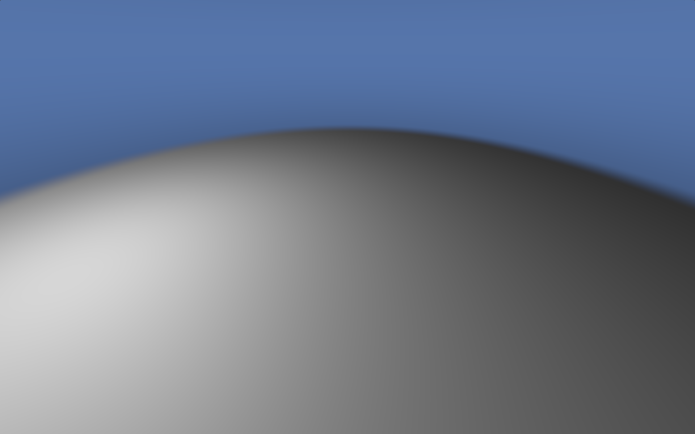
</p>

### 3. Box

We are going to draw an axis-aligned box defined by its `dimension` using an analytically derived intersection between the ray and an axis-aligned box from [Intersectors]. The function below is slightly modified:
```glsl
float raytrace_box
(
  in vec3 ro, 
  in vec3 rd, 
  out vec3 normal, // Normal at the hit point
  in vec3 box_dimension,
  in bool entering
) 
{
  // Having an equation ro + t * rd, we calculate an intersection `t` with 3 planes : xy, xz, and yz.
  // we calculate `t`, such that our ray hits the planes xy, xz, yz.
  // The result for each plane is stored in z, y, x coordinates of the `t` variable respectively.
  vec3 dr = 1.0 / rd;
  vec3 t = ro * dr;
  // Now we need to offset the `t` to hit the planes that form the box.
  // If we take a point at the corner of the box and calculate the distance needed to travel from that corner
  // to all three planes, we can then take that distance and subtract from or add to our `t`, to get the proper hit value.
  vec3 dt = box_dimension * abs( dr );
  
  // Planes facing us are closer, so we need to subtruct
  vec3 pin = - dt - t;
  // Planes behind the front planes are farther, so we need to add
  vec3 pout =  dt - t;

  // From the distances to all the front and back faces, we find faces of the box that are actually hit by the ray
  float tin = max( pin.x, max( pin.y, pin.z ) );
  float tout = min( pout.x, min( pout.y, pout.z ) );

  // Ray is outside of the box
  if( tin > tout )
  { 
    return -1.0;
  }

  // Calculate the normal
  if( entering )
  {
    normal = -sign( rd ) * step( pin.zxy, pin.xyz ) * step( pin.yzx, pin.xyz );
  } 
  else 
  {
    normal = sign (rd ) * step( pout.xyz, pout.zxy ) * step( pout.xyz, pout.yzx );
  }

  return entering ? tin : tout;
}
```

The function returns the distance to the hit point from the `ro` and writes the normal of the box to the `normal` vector;

In the `main` function, as with the plane, we find the intersection with the box and color it if there is a hit:
```glsl
const vec3 BOX_DIMENSIONS = vec3( 0.75, 1.25, 0.75 );

// ...

vec3 box_normal;
float box_t = raytrace_box( ro, rd, box_normal, BOX_DIMENSIONS, true );

if( box_t > 0.0 )
{
  final_color = vec3( 0.0 );
  // Intersection point with the box
  vec3 ro = ro + box_t * rd;

  // Color Here
}
```

The edges will have a dark, smooth stitch to cover the transition between the sides. To calculate the stitch, we need to determine the distance to each edge:
```glsl
// Distance to the edges
const vec3 BOX_DTE = vec3
( 
  length( BOX_DIMENSIONS.xz ), 
  length( BOX_DIMENSIONS.xy ), 
  length( BOX_DIMENSIONS.yz ) 
);
```

As the position of the hit point approaches the edges, we use a smoothstep of the distance to the edge to determine the color of our box. The smoothstep is calculated for all edges simultaneously, and we use the value corresponding to the closest edge:
```glsl

// Paint the edges black with a slight blur at the transition
float smooth_box_edge( in vec3 ro )
{
  vec3 edge_blur = smoothstep
  ( 
    BOX_DTE - vec3( 0.02 ), 
    BOX_DTE, 
    vec3( length( ro.xz ), length( ro.xy ), length( ro.yz ) ) 
  );

  return max( edge_blur.x, max( edge_blur.y, edge_blur.z ) );
}
```
In the main function, we blend the color of the box with the color of the edge 
```glsl
const vec3 BOX_EDGE_COLOR = vec3( 0.0 );

// ...

float edge_t = smooth_box_edge( ro );
final_color = mix( final_color, BOX_EDGE_COLOR, edge_t ) ;

```

If you paint the box white, you'll get this:

<p align="center">
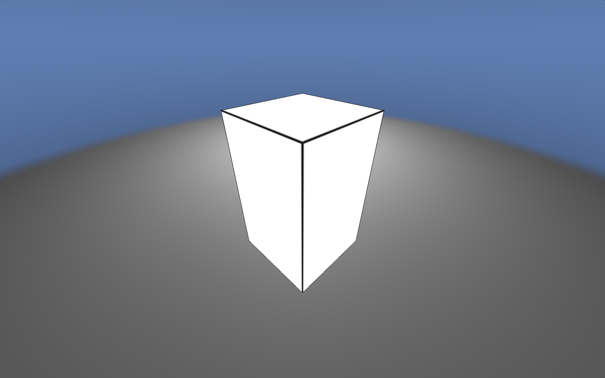
</p>

#### 4. Shadow

The shadow will be created using Inigo Quilez's implementation of soft shadows from [Box functions]:

```glsl
float seg_shadow( in vec3 ro, in vec3 rd, in vec3 pa, in float sh )
{
  float k1 = 1.0 - rd.x * rd.x;
  float k4 = ( ro.x - pa.x ) * k1;
  float k6 = ( ro.x + pa.x ) * k1;
  vec2 k5 = ro.yz * k1;
  vec2 k7 = pa.yz * k1;
  float k2 = -dot( ro.yz, rd.yz );
  vec2 k3 = pa.yz * rd.yz;
  
  for( int i = 0; i < 4; i++ )
  {
    vec2 ss = vec2( i & 1, i >> 1 ) * 2.0 - 1.0;
    float thx = k2 + dot( ss, k3 );
    if( thx < 0.0 ) { continue; } // behind
    float thy = clamp( -rd.x * thx, k4, k6 );
    sh = min( sh, dot2( vec3( thy, k5 - k7 * ss ) + rd * thx ) / ( thx * thx ) );
  }
  return sh;
}

// https://iquilezles.org/articles/boxfunctions/
// https://www.shadertoy.com/view/WslGz4
float box_soft_shadow
( 
  in vec3 ro, 
  in vec3 rd,
  in vec3 rad,   // box semi-size
  in float sk  
) 
{
  vec3 m = 1.0 / rd;
  vec3 n = m * ro;
  vec3 k = abs( m ) * rad;
  vec3 t1 = -n - k;
  vec3 t2 = -n + k;

  float tN = max( max( t1.x, t1.y ), t1.z );
  float tF = min( min( t2.x, t2.y ), t2.z );

  if( tN > tF || tF < 0.0 )
  {
    float sh = 1.0;
    sh = segShadow( ro.xyz, rd.xyz, rad.xyz, sh );
    sh = segShadow( ro.yzx, rd.yzx, rad.yzx, sh );
    sh = segShadow( ro.zxy, rd.zxy, rad.zxy, sh );
    return smoothstep( 0.0, 1.0, sk * sqrt( sh ) );
  }
  return 0.0;
}
```

In a `draw_background` function, right before smoothing the plane, we calculate the shadow factor, smooth it out to get lighter shadows, and multiply it by the color of our plane:
```glsl
float shad = box_soft_shadow
( 
  plane_hit, 
  normalize( LIGHT_SOURCE - plane_hit ), 
  BOX_DIMENSIONS, 
  2.0 
);
plane_color *= smoothstep( -0.2, 1.0, shad );
```
The result:

<p align="center">
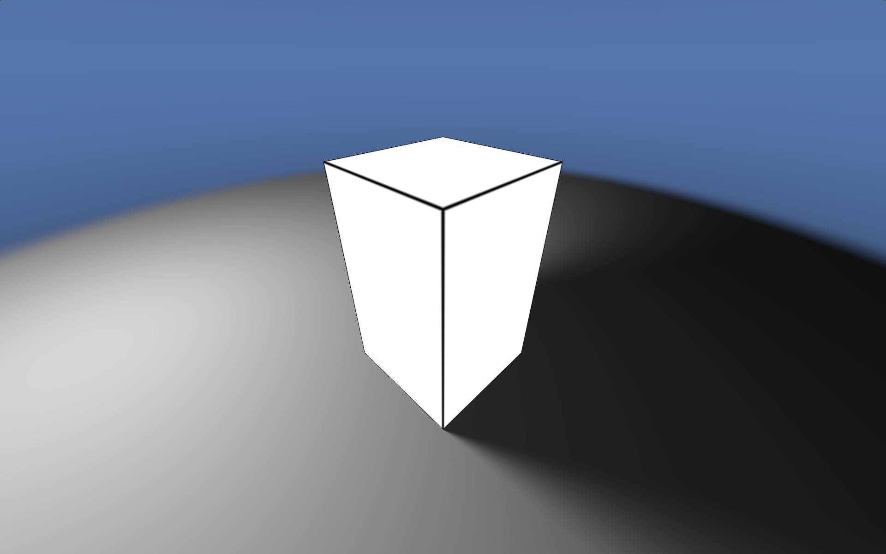
</p>

### 5. Box surface

We will cover the surface with water-like noise, which can then be use to calculate normals and apply them in the calculations for reflected and refracted light.

#### 5.1. Water noise

To create noise, we need a hashing function - a mapping from one value to another. In our case, it maps a `vec2` to a `float`:

```glsl
float hash2dx1d( in vec2 p ) 
{
	float h = dot( p, vec2( 127.1,311.7 ) );	
  return fract( sin( h ) * 43758.5453123 );
}
```
The idea is to shuffle the input in any way you like using prime numbers, then convert it into a number within the range [ 0.0, 1.0 ] which can then be transformed into any desired range. The example above is taken from [Random / noise functions for GLSL].  

With a hash function, we can generate [Perlin Noise]:
```glsl
float perlin_noise2dx1d( in vec2 p )
{
  vec2 i = floor( p );
  vec2 f = fract( p );	
	vec2 u = smoothstep( vec2( 0.0 ), vec2( 1.0 ), f );

  float noise = mix( mix( hash2dx1d( i + vec2( 0.0,0.0 ) ), 
                          hash2dx1d( i + vec2( 1.0,0.0 ) ), u.x ),
                     mix( hash2dx1d( i + vec2( 0.0,1.0 ) ), 
                          hash2dx1d( i + vec2( 1.0,1.0 ) ), u.x ), u.y );

  return noise * 2.0 - 1.0;
}
```

The code divides the `p` domain into a grid, hashes all four corners of the grid, and blends them together.  
Now, lets create the base of our water noise:

```glsl
float water_octave( in vec2 uv, in float choppy )
{
  // Shift the uv value in y = x direction by the noise value
  uv += perlin_noise2dx1d( uv );
  vec2 s_wave = 1.0 - abs( sin( uv ) );
  vec2 c_wave = abs( cos( uv ) );
  s_wave = mix( s_wave, c_wave, s_wave );
  return pow( 1.0 - pow( s_wave.x * s_wave.y, 0.65 ), choppy );
}
```
The technique is called [Domain warping].   
First, we shift the `uv` domain in the x = y direction to introduce randomness. Taking the `sin` of `uv` creates a plane of black and white circles with grey in between. Applying `abs` convertes the black circles to white, giving the pattern a more rigid appearance. Subtracting from `1.0` inverts the plane.  
The same process is applied with `cos`, but without the inversion. The two noise patterns are then blended together. In the final result, we combine both coordinates and raise them to a power to  enhance the contrast. The process is illustrated in the image below:

<p align="center">
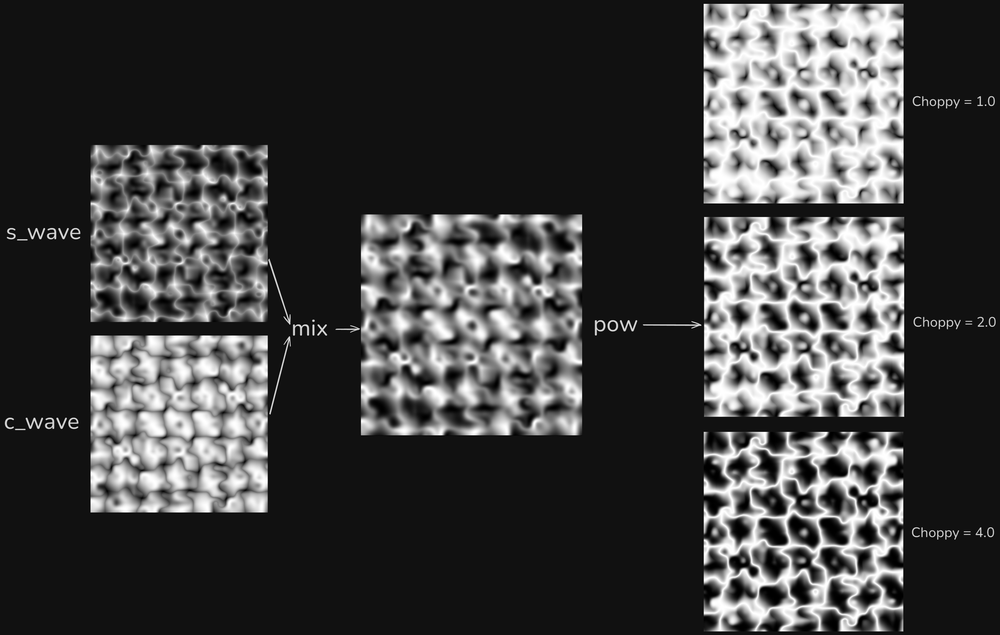
</p>

Having a base noise, we can use another technique, [Fractional Brownian Motion], to combine the noise we created with itself at different frequencies:

```glsl
// Fbm based sea noise
float water_noise( in vec2 p )
{
  float freq = 0.16;
  float amp = 0.6;
  float choppy = 4.0;
  mat2 octave_m = mat2( 1.6, 1.2, -1.2, 1.6 );
  p.x *= 0.75;

  float h = 0.0;    

  for( int i = 0; i < 5; i++ ) 
  { 
    // Mix two octaves for better detail
    float d = water_octave( ( p + iTime / 2.0 ) * freq, choppy ) + water_octave( ( p - iTime / 2.0 ) * freq, choppy );
    // Add the height of the current octave to the sum
    h += d * amp;        
    // Deform p domain( rotate and stretch)
    p *= octave_m; 
    freq *= 1.9; 
    amp *= 0.22;
    choppy = mix( choppy, 1.0, 0.2 );
  }

  return h;
}
```

We define an initial state with a starting amplitude, frequency, and choppiness. `octave_m` is a rotation and scale matrix used to further distort the space. In each iteration, we sample the base noise at the current frequency, scale it by the current amplitude, and add it to the result. Then, the amplitude, frequency, and the `p` domain are updated, and the process is repeated for another iteration:

<p align="center">
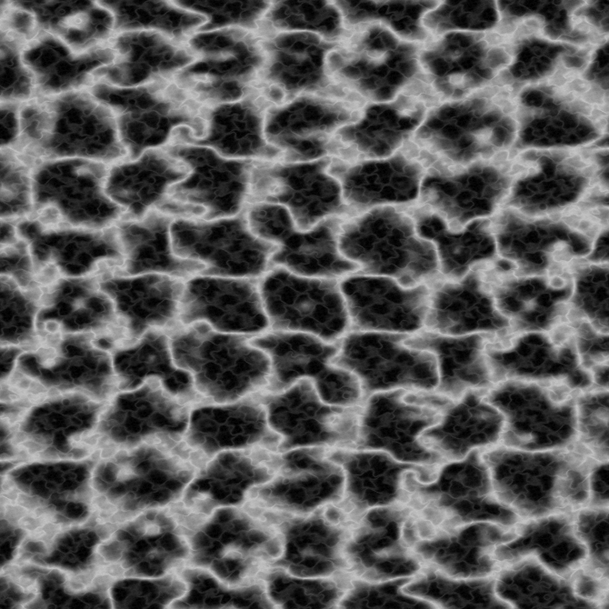
</p>

Links:
- [Perlin Noise]
- [Understanding Perlin Noise]
- [Fractional Brownian Motion]
- [Domain warping]

#### 5.2. Normal mapping

Assuming our noise lies in the XZ plane, to determine the normal at any position, we calculate the derivative in the Z and X directions to obtain the slope in those directions. The cross product of these two vectors - ( 0.0, df/dz, 1.0 ) and ( 1.0, df/dx, 0.0 ) - provides the surface normal in the Y direction. For more details, see [Painting a Landscape with Maths]


```glsl
const float WATER_INTENSITY = 0.5;

// ...

vec3 water_normal( in vec2 p )
{
  float e = 0.01;
  vec2 offset = vec2( 1.0, 0.0 ) * e;
  float dfdx = ( water_noise( p + offset.xy ) - water_noise( p - offset.xy ) );
  float dfdz = ( water_noise( p + offset.yx ) - water_noise( p - offset.yx ) );
  vec3 normal = normalize( vec3( -dfdx, e / WATER_INTENSITY, -dfdz ) );
  return normal;
}
```
By increasing `WATER_INTENSITY`, you reduce the influence of the Y component, thereby increasing the deviation of the normal from the `up` direction of the normal(as if enlarging the waves). The `e` parameter represents a small change in the X or Z direction.

The normals now need to be reoriented to align with the box's normal. This process, known as [Normal Mapping], is very similar to the transformation we applied to the ray directions.

For an axis-aligned box, all normals point in the direction of one of the axes. The other two vectors ( tangent and bitangent ) will align with the directions of the other two axes.

```glsl
const vec2 M = vec2( 1.0, 0.0 );

// ...

if( box_t > 0.0 )
{
  // ...
  vec3 w = box_normal;
  vec3 u = normalize( M.xyy * w.z - M.yyx * w.x - M.yyx * w.y );
  vec3 v = normalize( M.yxy * w.z + M.yxy * w.x - M.xyy * w.y );
  mat3 TBN = mat3( u, w, v );
  // ...
}
```

To sample the noise, we need to get the UV coordinates for the box's face.

```glsl
const float INSIDES_NOISE = 0.3

vec2 uv = ro.xy * w.z + ro.xz * w.y + ro.yz * w.x;
uv *= INSIDES_NOISE
```

The `INSIDES_NOISE` constant allows you to control the scale of the noise.  

```glsl
vec3 n = normalize( TBN * water_normal( uv ) );
```

We get the normal from the noise and transform it using the `TBN` matrix.

Links:
- [Painting a Landscape with Maths]
- [Normal Mapping]

#### 5.3. Surface reflection

Using the normal, we can calculate the refracted and reflected rays using built-in functions. To calculate the refracted ray, we need to know the [Refractive Index] of both mediums

```glsl
const float airRI = 1.0;
// Refractive index of the box( water )
const float boxRI = 1.33;
// Index of refraction Air to Box
const float iorAtoB = airRI / boxRI;
// Index of refraction Box to Air
const float iorBtoA = boxRI / airRI;

// ...

if( box_t > 0.0 )
{
  // ...

  vec3 refractedRD = refract( rd, n, iorAtoB );
  vec3 reflectedRD = normalize( reflect( rd, n ) );
  
  // ...
}
```

Light splits into two components, meaning its energy is divided. We use the Fresnel equation to calculate the proportion of light reflected `F`, and from that, the propotion of light refracted `1.0 - F`. To compute Fresnel, we need the critical reflection angle, beyond which the light is fully reflected, and the Fresnel value at 0 degrees incidence relative to the normal:
```glsl
const vec3 F0 = vec3( pow( abs( ( boxRI - airRI ) ) / ( boxRI + airRI ), 2.0 ) );
const float CRITICAL_ANGLE_ATOB = sqrt( max( 0.0, 1.0 - iorBtoA * iorBtoA ) );
const float CRITICAL_ANGLE_BTOA = sqrt( max( 0.0, 1.0 - iorAtoB * iorAtoB ) );
// ...

if( box_t > 0.0 )
{
  // ...
  // New
  vec3 F = fresnel( prev_rd, n, F0, CRITICAL_ANGLE_BTOA );
  vec3 refractedRD = refract( rd, n, iorAtoB );
  vec3 reflectedRD = normalize( reflect( rd, n ) );
  
  // ...
}
```

Links:
- [Refractive Index]
- [List of refractive indices]
- [PBR Theory]
- [Computer Graphics Tutorial - PBR]
- [Microfacet BRDF]

For the refracted ray, we define a new function, `draw_insides`, to handle the contents inside the box. For the reflected ray, we simply call the `draw_background` function with the new ray direction. Both colors are then multiplied by the Fresnel factor.

```glsl
if( box_t > 0.0 )
{
  // If any refraction happens
  if( length( refractedRD ) > 0.0 )
  {
    refractedRD = normalize( refractedRD );
    vec3 insides_color = draw_insides( ro, refractedRD );
    final_color += ( 1.0 - F ) * insides_color;
  }

  vec3 refl_color = draw_background( ro, reflectedRD );
  final_color += F * refl_color;
}
```
If `draw_insides` returns black, then we will get the following image:

<p align="center">
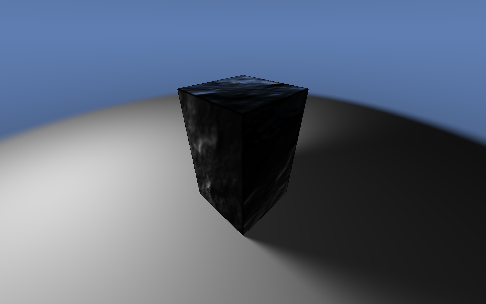
</p>

### 6. Box's indsides

For the insides, we'll go with a cosmic theme, starting by drawing some stars.

#### 6.1. Stars

The stars will be drawn on a sphere located very far away. The view direction will define the position on the sphere by calculating the `theta` ( longitude ) and `phi` ( latitude ) angles:

```glsl
vec3 draw_stars( in vec3 rd )
{
  vec3 final_color = vec3( 0.0 );

  // Latitude
  float phi = atan( rd.x, rd.z );
  // Longitute
  float theta = asin( rd.y );

  // [ 1/2PI, 1/PI ]
  vec2 normalization = vec2( 0.1591, 0.3183 );
  vec2 uv = vec2( phi, theta ) * normalization + vec2( 0.5 );

  // ...
}
```
`atan` returns an angle in the range [ -π, π ], whose tangent equals to `x / z`.  
`asin` returns an angle in the range [ -π/2, π/2 ], whose sine equals `y`.     
To use these angles, we normalize them by dividing `phi` by `2π` and `theta` by `π`, which scales them to the range [ -0.5, 0.5 ]. Then, we shift the values by 0.5, to finally get the `uv` coordinates in the range [ 0.0, 1.0 ].  

`uv` represents a square in therange [ 0.0, 1.0 ], which we can scale by a factor and divide into a grid. To generate stars at different grid sizes with varying parameters, we will encapsulate this logic into its own function:

```glsl
vec3 generate_stars
(
  in vec2 uv,
  in float grid_size
)
{
  uv *= grid_size;

  // ...
}
```
The integer part of `uv` will represent the `cell_id`, while the fractional part will give the coordinates relative to that cell. To generate the star's position, we will pass the cell's ID to the `hash` function, which takes a `vec2` and returns a `vec2` - the position of the star within the cell. This way, each cell will be assigned a unique star position.  
The stars will also have a size, so we need to ensure the star fits entirely within the cell. To do this, we shift the star by the amount it protrudes outside the cell:

```glsl
vec3 generate_stars
(
  in vec2 uv,
  in float grid_size,
  in float star_size // New
)
{
  // ...

  vec2 cell_id = floor( uv );
  vec2 cell_coords = fract( uv ) - 0.5;
  vec2 star_coords = hash2dx2d( cell_id ) - 0.5;
  star_coords -= sign( star_coords ) * max( vec2( star_size ) - vec2( 0.5 ) + abs( star_coords ), vec2( 0.0 ) );

  // ...
}
```

The coordinates are shifted to be centered at 0.0, because it makes calculations simpler.  
To create a `glow`, we will use an exponent of the distance to the star scaled by the size of the star. This will produce a soft gradient that is intense at the center of the star, and fades quickly as the distance increases.  
To make the appearance more randomized, we will introduce the `brightness` parameter, which will influence the intensity of the `glow`. The brightness will be determined by using a hash function with the cell ID, just like we did for the star's position:

```glsl

float remap
( 
  in float t_min_in, 
  in float t_max_in, 
  in float t_min_out, 
  in float t_max_out, 
  in float v 
)
{
  float k = ( v - t_min_in ) / ( t_max_in - t_min_in );
  return mix( t_min_out, t_max_out, k );
}

// ...

{
  // ...

  vec2 delta_coords = abs( star_coords - cell_coords );
  // Distance to the star from the cell center
  float dist = length( delta_coords );
  vec3 glow = vec3( exp( -5.0 * length( dist ) / ( star_size * 2.0 ) ) );

  float brightness = remap( 0.0, 1.0, 0.5, 1.0, hash2dx1d( uv ) );

  return glow * brightness;
}
```
`remap` is the function that takes a value from one range, and converts it to another. In the example above, we `remap` the brightness to a smaller range to prevent the stars from becoming too dark to be visible.  

To distinguish large stars from smaller ones, we'll add an optical flare effect to the bigger stars. Knowing the distance to the star, the horizontal flare can be created by combining a smooth step in the X direction based on the star's size and in the Y direction based on the flare's width. The vertical flare is done in the same way, but with the axes reversed:

```glsl
vec3 generate_stars
(
  in vec2 uv,
  in float grid_size,
  in float star_size,
  // New
  in float flares_width, 
  in bool with_flare
)
{

  // ...

  if( with_flare )
  {
    float flare_change = remap( -1.0, 1.0, 0.5, 1.0, sin( iTime * 3.0 + uv.x * uv.y ) );
    float flares = smoothstep( flares_width, 0.0, delta_coords.x ) + smoothstep( flares_width, 0.0, delta_coords.y );
    flares *= smoothstep( star_size * flare_change, 0.0, dist );
    
    glow = glow * flares;
  }

  // ...
}
```
Flares will be animated using a remapped `sin` function with an arbitrary offset to create a pulsating effect. This will give the stars a dynamic, glowing appearance. Here's an example of a star with and without flares:

<p align="center">
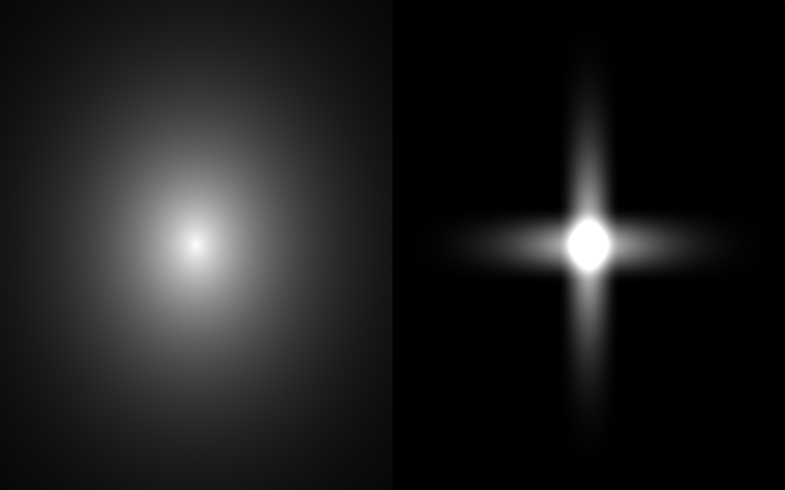
</p>

Having a method to generate stars, we can now run a loop to generate them and, at the end of each iteration, increase the grid size while reducing the star's size. Back in `draw_stars`, we first initialize some state:

```glsl
vec3 draw_stars( in vec3 rd )
{
  // ...

  float grid_size = 10.0;
  float star_size = 0.1;
  float flares_width = 0.08 * star_size;
  vec3 star_color = vec3( 1.0 );

  float star_size_change = 0.7;
  float grid_size_change = 2.0;

  // ...
}
```

Then, we will run two loops: one to generate stars with flares and the other to generate stars without flares:

```glsl
// Big stars are animated
for( int i = 0; i < 2; i++ )
{
  final_color += generate_stars( uv, grid_size, star_size, flares_width, true );
  star_size *= star_size_change;
  grid_size *= grid_size_change;
}

// Small stars are not animated
for( int i = 2; i < 5; i++ )
{
  final_color += generate_stars( uv, grid_size, star_size, flares_width, false );
  star_size *= star_size_change;
  grid_size *= grid_size_change;
}
```

<p align="center">
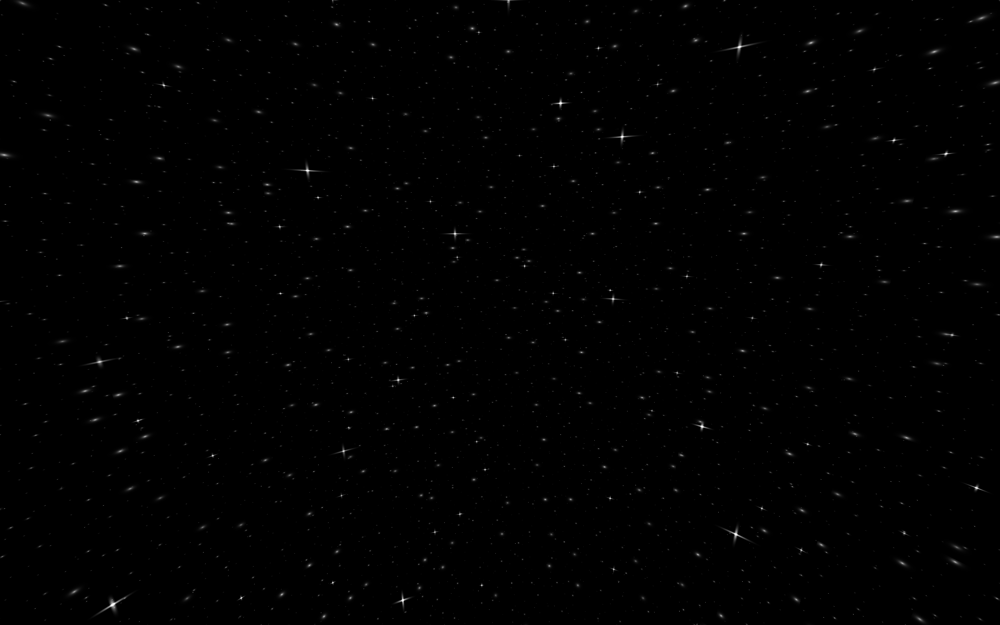
</p>

#### 6.2. Nebula

[Nebula] is a cloud that occupies a volume in space. To render this volume of matter, we will use a technique called [Ray marching]. However, before we can implement ray marching, we first need to generate 3D noise that will define the appearance of our Nebula.

##### 6.2.1. Nebula noise

First, we will define a base noise function that takes a 3D vector as input and returns a number. Similar to the water noise, we wlll use [Fractional Brownian motion] (FBM) to add detail and domain warping to modify the shape of the noise:
```glsl
float spiral_noise( in vec3 p )
{
  float n = 0.0;	// Noise accumulator
  float iter = 2.0;
  float nudge = 0.9; // Size of perpendicular vector
  float normalizer = 1.0 / sqrt( 1.0 + nudge * nudge ); // pythagorean theorem on that perpendicular to maintain scale
  for( int i = 0; i < 8; i++ )
  {
    // Add sin and cos scaled inverse with the frequency
    n += abs( sin( p.y * iter ) + cos( p.x * iter ) ) / iter;
    // Rotate around Z axis by adding perpendicular and scaling down
    p.xy += vec2( p.y, -p.x ) * nudge;
    p.xy *= normalizer;

    // Rotate around Y axis
    p.xz += vec2( p.z, -p.x ) * nudge;
    p.xz *= normalizer;
    // Increase the frequency
    iter *= 1.733733;
  }
  return n;
}
```

As you can see, we have the usual loop for FBM, where both frequency and amplitude share the same variable `iter`. The sum of `sin` and `cos` creates a grid of black and white circles. Taking the `abs` of the grid leaves only the white circles with black borders separating them, as shown in the image below. The base noise is independent of the Z axis, so in 3D, you can imagine infinite parallel tubes aligned along the Z axis.

<p align="center">
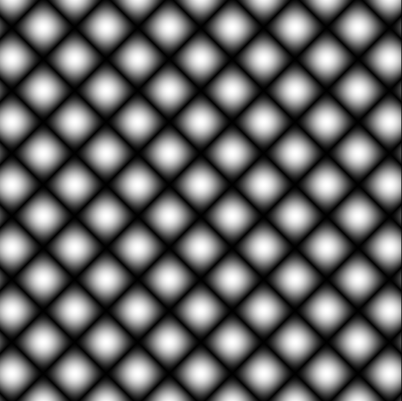
</p>

Once the noise is sampled, before starting the new iteration, we deform the `p` domain by first rotating it around the Z axis and then rotating it around the Y axis. While a rotation matrix could be used for this, we opt for a cheaper method: we add a perpendicular vector of length `nudge` to `p` and then scale the result so the length remains unchanged. This process is repeated 8 times, and the noise is ready.

The second part of the nebula's noise will incorporate 3D [Signed Distance Functions], specifically that of a torus, taken from here [3D SDFs].

```glsl
float sdf_torus( in vec3 p, in vec3 t )
{
  vec2 q = vec2( length2( p.xz ) - t.x, p.y );
  return max( length( q ) - t.y, abs( p.y ) - t.z );
}
```

`t.x` represents the main radius of the torus, `t.y` represents the inner radius, and `t.z` is a custom value that will clamp the distance field with XZ planes at Y = ±t.z. By adding the torus to our noise, we shape the final noise to resemble a torus.

```glsl
float nebula_noise( in vec3 p )
{
  float result = spiral_noise( p.zxy * 0.5123 + 100.0 ) * 3.0;
  result -= sdf_torus( p, vec3( 2.0, 1.8, 1.25 ) );
  return result;
}
```
For the spiral noise, we deform the `p` domain one more time before passing it to the noise, then scaling the result by 3.0. These values are arbitrary and are chosen based on what looks best and how the shapes are defined. We then subtract the SDF of the torus - this will make the noise inside the torus larger, and the noise outside smaller. This will be useful when rendering it with a ray marching loop.

##### 6.2.2. Raymarching

Our Nebula will be contained inside a sphere, so we need a function that will find the intersection of the ray with the sphere ( [Intersectors] ):
```glsl
vec2 raytrace_sphere( in vec3 ro, in vec3 rd, in vec3 ce, in float ra )
{
  vec3 oc = ro - ce;
  float b = dot( oc, rd );
  float c = dot( oc, oc ) - ra * ra;
  float h = b * b - c;
  if( h < 0.0 ) { return vec2( -1.0 ); } // no intersection
  h = sqrt( h );
  return vec2( -b - h, -b + h );
}
```

First, we define a function that will render the Nebula:

```glsl
vec3 draw_nebula( in vec3 ro, in vec3 rd )
{
  vec4 final_color = vec4( 0.0 );
  // Redius of the sphere that envelops the nebula
  float radius = 6.0;
  // Max allowed density
  float h = 0.1;
  float optimal_radius = 3.0;
  float k = optimal_radius / radius;

  // ...

  return smoothstep( 0.0, 1.0, final_color.rgb );
}
```

Since the noise is defined in 3D space, and I've found that a bounding sphere with a radius of 3.0 produces the best result. I wanted to be able to resize the sphere, without changing its contents. To achieve this, I add a `k` parameter that will properly scale the values that need to be scaled. The smoothstep at the end is used to make the colors appear sharper.  
As we move through the volume, we'll keep track of some state, primarily `total_density`, which will indicate the density of the medium up to that point:

```glsl
// ...

vec3 p; // Current position inside the volume
float local_density = 0.0; // Density at the position
float total_density = 0.0; // Total accumulated density
float weight = 0.0; // Contribution of the current point

// ...
```
Now, we need to find the intersection with the bounding sphere. If a hit is detected, we begin the ray marching loop:

```glsl
vec2 vt = raytrace_sphere( ro, rd, vec3( 0.0 ), radius );
// Itersection point when entering the sphere
float tin = vt.x;
// Intersection point when exiting the sphere
float tout = vt.y;
float t = max( tin, 0.0 );

// If sphere was hit
if( any( notEqual( vt, vec2( -1.0 ) ) ) )
{
  for( int i = 0; i < 64; i++ )
  {
    if( total_density > 0.9 || t > tout ) { break; }
    // ...
  }
}

// ...
```
We clamp `t` to 0.0 in case we are inside the sphere, ensuring that we start the ray marching from the current position. We also add some break conditions to the loop, such as checking if `t` exceeds `tout`. If it does, that means we've exited the sphere, and there's no need to continue marching forward.
```glsl
// ...

// Current posititon inside the sphere
p = ro + t * rd;
p *= k;
// Get the density at the current position
float d = abs( nebula_noise( p * 3.0 ) * 0.5 ) + 0.07;

// ...
```
We get the current position `p` and feed it to the noise function. All the values involved in the noise calculation are arbitrary and are chosen solely to improve the visual result.  
The nebula will have a star at its center that radiates light in all directions. To determine the color of the star, we first need to calculate the distance to the star. Then, by using exponentiation, we reduce the light contribution to the final color based on the distance to the light source:

```glsl
// Distance to the light soure
float ls_dst = max( length( p ), 0.001 ); 

// The color of light 
float _T = ls_dst * 2.3 + 2.6;
vec3 light_color = 0.4 + 0.5 * cos( _T + PI * 0.5 * vec3( -0.5, 0.15, 0.5 ) );
final_color.rgb += vec3( 0.67, 0.75, 1.0 ) / ( ls_dst * ls_dst * 10.0 ) / 80.0; // star itself
final_color.rgb += light_color / exp( ls_dst * ls_dst * ls_dst * 0.08 ) / 30.0; // bloom
```

`light_color` is defined as a [Cosine gradient], to match the color scheme of the nebula. The light's contribution exponentially decreases with distance. We add two colors: one for the `star` itself and one for the `bloom`. As you can see, the `star` color fades very rapidly, creating a shiny sphere at the center, while the bloom colore fades more slowly, extending all the way to the edges of the sphere.

Above, a constant `h` was defined as a maximum local density. If the density at the current position is less than `h`, we include it in the calculations:

```glsl
if( d < h )
{
  // Compute local density 
  local_density = h - d;
  // Compute weighting factor. The more density accumulated so far, the less weight current local density has
  weight = ( 1.0 - total_density ) * local_density;
  // Accumulate density
  total_density += weight * weight * 8.0  + 1.0 / 200.0;
  
  // ...
}
```

As we stack layers on top of each other, we need a weight to determine how much each layer will contribute to the final result, or in other words, determine its influence. In this case, the weight is proportionally dependent on the `local_density` and inversely dependent on the `total_density`. The current layer is then added to the `total_density` based on its weight. The exact weighing is arbitrary and can be adjusted according to preferences.

```glsl
vec3 nebula_color( in float density, in float radius )
{
  // Color based on density alone, gives impression of occlusion within the media
  vec3 result = mix( vec3( 1.0 ), vec3( 0.5 ), density );
	
  // Color added to the media
  vec3 col_center = 7.0 * vec3( 0.8, 1.0, 1.0 );
  vec3 col_edge = 1.5 * vec3( 0.48, 0.53, 0.5 );
  result *= mix( col_center, col_edge, min( ( radius + 0.05 ) / 0.9, 1.15 ) );
  return result;
} 
// ...

if( d < h )
{
  // ...

  // Transparency falls, as the density increases
  vec4 col = vec4( nebula_color( total_density, ls_dst ), total_density );

  // Emission. The densier the medium gets, the brighter it shines
  final_color.rgb += final_color.a * final_color.rgb * 0.2;	  
  // Uniform scale density
  col.a *= 0.2;
  // Color by alpha
  col.rgb *= col.a;
  // Alpha blend in contribution
  final_color = final_color + col * ( 1.0 - final_color.a );
}
```
`nebula_color` calculates the color based on both density and the distance from the center. Mixing colors according to density darkens them where the medium is denser, creating an occlusion effect within the medium. Additionally, colors are further darkened based on the distance from the center of the Nebula.  
An emission effect is added by adding the current color to itself based on the current total density and some arbitrary factor `0.2`. `col` is then reduced and blended with the current color.

```glsl
total_density += 1.0 / 70.0;
// Optimize step size near the camera and near the light source. The densier field - the bigger step
t += max( d * 0.1 * max( min( ls_dst, length( ro * k ) ), 1.0 ), 0.01 ) / k;
```
At the end of the loop, we artificially add more density to keep the medium more sparse, and then step `t` forward by an amount, based on the local density and the distance to the camera. This ensures that the ray marches through the volume in a controlled manner.

The final touch is to add scattering based on the total density. The denser the medium, the more light scatters in all directions, which reduces its brightness. This effect simulates how light interacts wit the particles within the Nebula:

```glsl
// Simple scattering
final_color *= 1.0 / exp( total_density * 0.2 ) * 0.8;
```

Combining our stars and nebula, we get the following result:

```glsl
vec3 draw_box_background
(
  in vec3 ro,
  in vec3 rd
)
{
  vec3 final_color = vec3( 0.0 );

  final_color += draw_stars( rd );
  final_color += draw_nebula( ro, rd );

  return final_color;
}
```

<p align="center">
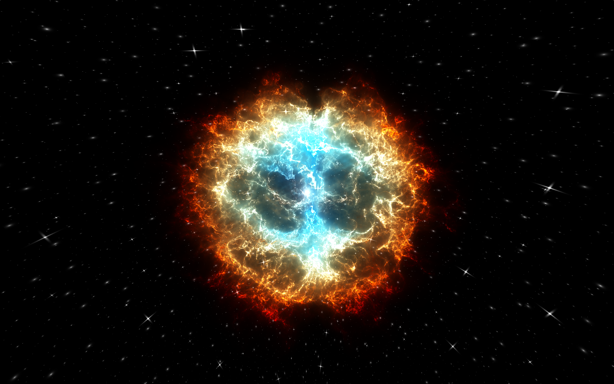
</p>

### 7. Inside reflections

Time to add some reflections inside the box. The process is similar to how we handled refractions and reflections from the outside. We return to the function `draw_insides`, which has been returning black color up until now:

```glsl
const int NUM_REFLECTIONS = 2;

// ...

vec3 draw_insides
(
  in vec3 ro,
  in vec3 rd
)
{
  float distance_traveled = 1.0;
  vec3 final_color = vec3( 0.0 );
  vec3 prev_ro = ro;
  vec3 prev_rd = rd;
  vec3 attenuation = vec3( 1.0 );

  // ...
  for( int i = 0; i < NUM_REFLECTIONS; i++ )
  {
    // ...
  }

  return final_color;
}
```

`distance_traveled` will keep track of the total distance our ray travels, so we can use it to attenuate color based on that distance. `attenuation` will store the product of the Fresnel value at each reflection. At each iteration, `prev_ro` and `prev_rd` will be updated with new the new hit point and reflected direction, respectively.

```glsl
const float INNER_BOX_SCALE = 6.0;
// ...

vec3 inside_color = draw_box_background( prev_ro * INNER_BOX_SCALE, prev_rd );
final_color += inside_color * attenuation;

// ...
```

We draw the color for the box's background and attenuate it. Instead of shrinking the background, we scale the position by the `INNER_BOX_SCALE` constant, giving the illusion that the box is larger on the inside.

```glsl
{
  // ...

  vec3 box_normal;
  float box_t = raytrace_box( prev_ro, prev_rd, box_normal, BOX_DIMENSIONS, false );

  vec3 new_ro = prev_ro + box_t * prev_rd;
  distance_traveled += length( prev_ro - new_ro );

  vec3 w = box_normal;
  vec3 u = M.xyy * w.z - M.yyx * w.x - M.yyx * w.y;
  vec3 v = M.yxy * w.z + M.yxy * w.x - M.xyy * w.y;
  mat3 TBN = mat3( u, w, v );

  vec2 uv = new_ro.xy * w.z + new_ro.xz * w.y + new_ro.yz * w.x;
  uv *= INSIDES_NOISE;

  vec3 n = TBN * water_normal( uv );

  vec3 F = fresnel( prev_rd, n, F0, CRITICAL_ANGLE_BTOA );
  vec3 reflectedRD = normalize( reflect( prev_rd, -n ) );
  vec3 refractedRD = refract( prev_rd, -n , iorBtoA );

  attenuation *= F;
  prev_ro = new_ro;
  prev_rd = reflectedRD;
}
```

The rest of the loop follows the same process as when we handled the box's reflections from the outside.

The final render:

<p align="center">
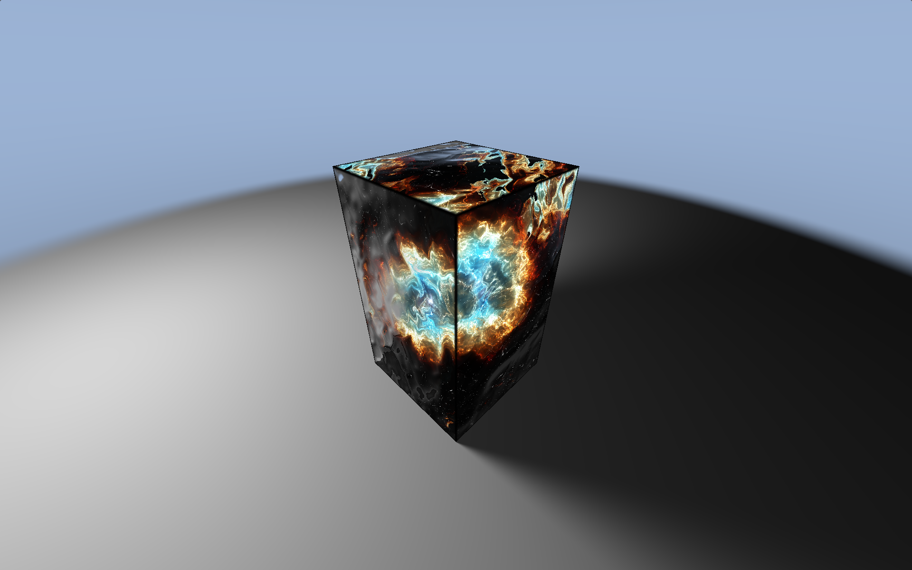
</p>

Shaders:
- [Cube lines Shader]
- [Strange Crystal Shader]
- [Seascape Shader]
- [Supernova remnant Shader]
- [Helix nebula Shader]
- [Cheap Cloud Flythrough Shader]
- [Alien Beacon Shader]
- [Box - fake soft shadow Shader]

Other links:
- [Fundamentals of Computer Graphics]
- [Confused with Coordinate Transformations]
- [Computer Graphics Chapter – 7 (part - B)]
- [Line-plane intersection]
- [Intersectors]
- [Blinn-Phong reflection model]
- [Gamma correction]
- [Perlin Noise]
- [Understanding Perlin Noise]
- [Fractional Brownian Motion]
- [Domain warping]
- [Painting a Landscape with Maths]
- [Normal Mapping]
- [Box functions]
- [Computer Graphics Tutorial - PBR]
- [Refractive Index]
- [List of refractive indices]
- [PBR Theory]
- [Microfacet BRDF]
- [Lens flare]
- [Ray marching]
- [Coding Adventure: Ray Marching]
- [An introduction to Raymarching]
- [Random / noise functions for GLSL]
- [Nebula]
- [Signed Distance Functions]
- [3D SDFs]
- [Cosine gradient]

[Cube lines Shader]: https://www.shadertoy.com/view/NslGRN

[Fundamentals of Computer Graphics]: https://www.amazon.com/Fundamentals-Computer-Graphics-Steve-Marschner/dp/1482229390

[Confused with Coordinate Transformations]: https://computergraphics.stackexchange.com/questions/12594/confused-with-coordinate-transformations

[Computer Graphics Chapter – 7 (part - B)]: https://imruljubair.github.io/teaching/material/CSE4203/Chapter%20-%207%20(part%20-%20B).pdf

[Line-plane intersection]: https://en.wikipedia.org/wiki/Line%E2%80%93plane_intersection

[Intersectors]: https://iquilezles.org/articles/intersectors/

[Blinn-Phong reflection model]: https://en.wikipedia.org/wiki/Blinn%E2%80%93Phong_reflection_model

[Gamma correction]: https://en.wikipedia.org/wiki/Gamma_correction

[Strange Crystal Shader]: https://www.shadertoy.com/view/tsVXzh

[Seascape Shader]: https://www.shadertoy.com/view/Ms2SD1

[Perlin Noise]: https://en.wikipedia.org/wiki/Perlin_noise

[Understanding Perlin Noise]: https://adrianb.io/2014/08/09/perlinnoise.html

[Fractional Brownian Motion]: https://iquilezles.org/articles/fbm/

[Domain warping]: https://iquilezles.org/articles/warp/

[Painting a Landscape with Maths]: https://youtu.be/BFld4EBO2RE?t=389

[Normal Mapping]: https://learnopengl.com/Advanced-Lighting/Normal-Mapping

[Box - fake soft shadow Shader]: https://www.shadertoy.com/view/WslGz4

[Box functions]: https://iquilezles.org/articles/boxfunctions/

[Computer Graphics Tutorial - PBR]: https://www.youtube.com/watch?v=RRE-F57fbXw&list=PLeb33PCuqDdesjTOgWXXAF4-gjknPPhBm

[Refractive Index]: https://en.wikipedia.org/wiki/Refractive_index

[List of refractive indices]: https://en.wikipedia.org/wiki/List_of_refractive_indices

[PBR Theory]: https://learnopengl.com/PBR/Theory

[Microfacet BRDF]: https://www.youtube.com/watch?v=gya7x9H3mV0&list=PLeb33PCuqDdesjTOgWXXAF4-gjknPPhBm&index=7

[Lens flare]: https://en.wikipedia.org/wiki/Lens_flare

[Supernova remnant Shader]: https://www.shadertoy.com/view/MdKXzc

[Helix nebula Shader]: https://www.shadertoy.com/view/cdK3Wy

[Ray marching]: https://en.wikipedia.org/wiki/Ray_marching

[Coding Adventure: Ray Marching]: https://www.youtube.com/watch?v=Cp5WWtMoeKg

[An introduction to Raymarching]: https://youtu.be/khblXafu7iA

[Random / noise functions for GLSL]: https://stackoverflow.com/questions/4200224/random-noise-functions-for-glsl

[Nebula]: https://spaceplace.nasa.gov/nebula/en/

[Signed Distance Functions]: https://hackaday.com/2023/04/12/signed-distance-functions-modeling-in-math/

[3D SDFs]: https://iquilezles.org/articles/distfunctions/

[Cosine gradient]: http://dev.thi.ng/gradients/

[Cheap Cloud Flythrough Shader]: https://www.shadertoy.com/view/Xsc3R4

[Alien Beacon Shader]: https://www.shadertoy.com/view/ld2SzK