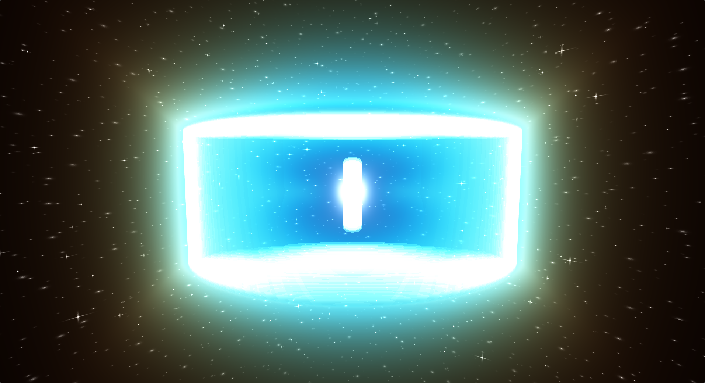

### 1. Basic setup
For our shader we are going to use raytracing to draw the scene, so first we need to generate our rays. A ray has an origin and a direction. The origin will be our camera's position. From the origin we are going to shoot one ray per pixel in camera's view direction.  
Before we shoot a ray from camera's position we generate ray direction in the following manner:

```glsl
vec3 rd = vec3( ( fragCoord * 2.0 - iResolution.xy ) / iResolution.x, 0.7 );
```

We shift the fragment's screen space position to be centered at the  origin( [ 0.0, 0.0 ]), and then we normalize them by the width of the screen. This way we are going to have uniform speed across X and Y axis, when we move our camera. Z value defines FOV of the camera - the bigger it is, the more zoomed in the view will be. Thus for every pixel we get a vector that specifies that ray direction for the pixel.

The rays need to be transformed to aligh with camera's view direction. For the we are going to create a rotation matrix that will transform rays defined in wolrds coordinates to rays defined in camera's coordinates:

```glsl
// Orthonormal vectors of the view transformation
vec3 vz = normalize( view_dir );
vec3 vy = normalize( up );
vec3 vx = normalize( cross( vz, vy ) );
vy = normalize( cross( vx, vz ) );
mat3 m = mat3( vx, vy, vz );
```

Camera is defined by its `view direction` and `up` vector. Camera's coordinate system is then defined as follows: Z axis will point in the `view direction`, X axis is perpendicular to the `up` and `view direction` vectors, and Y axis will be perpendicular to the X and Z. We normalize all vectors and pack them into matrix - this will be our rotation matrix.   

Now we apply camera's rotation to our rays:

```glsl
rd = normalize( m * rd );
```

Here are a few resources to help with understanding:
- [Fundamentals of Computer Graphics]
- [Confused with Coordinate Transformations] 
- [Computer Graphics Chapter – 7 (part - B)]

### 2. Background

We define a seperate function to draw background:
```glsl
vec3 draw_background
(
  in vec3 ro,
  in vec3 rd
)
{
  vec3 final_color = vec3( 0.0 );

  // ...

  return final_color;
}
```

#### 2.1. Color
The color will be a symmetrical gradient in the Y direction, that starts at 0.0 and ends at 1.0. We smooth out the Y value for a softer change.
```glsl
vec3 bgcol( in vec3 rd )
{
  return mix
  ( 
    vec3( 0.01 ), 
    vec3( 0.336, 0.458, 0.668 ), 
    smoothstep( 1.0, 0.0, abs( rd.y ) ) 
  );
}
```

#### 2.2. Plane
The plane is defined by its normal, any point on the plane, and to not stretch to infinity, we will clap it in [ -12.0, 12.0 ] range:
```glsl
float plane_size = 12.0;
vec3 plane_normal = vec3( 0.0, 1.0, 0.0 ); // Normal of the plane
vec3 p0 = PLANE_P; // Any point on the plane
```
To draw a plane, we need to find a point of intersection between our ray and the plane. The formula can be derived analitically and translated directly to the code:

```glsl
float raytrace_plane
( 
  in vec3 ro, // Ray origin
  in vec3 rd, // Ray direction
  in vec3 normal, // Normal of the plane
  in vec3 p0 // Any point on the plane
)
{
  // If this equals 0.0, then the line is parallel to the plane
  float RdotN = dot( rd, normal );
  if( RdotN == 0.0 ) { return -1.0; }

  float t = dot( ( p0 - ro ), normal ) / RdotN;
  return t;
}
```
Links:
- [Line-plane intersection]
- [Intersectors]

Then we call it like this:
```glsl
float plane_t = raytrace_plane( ro, rd, plane_normal, p0 ); // Distance to the plane
```

If `plane_t` is bigger than 0.0, then we got a hit in a positive direction of our ray.

```glsl
float plane_t = raytrace_plane( ro, rd, plane_normal, p0 );

if( plane_t > 0.0 )
{
  vec3 plane_hit = ro + plane_t * rd;
  vec2 uv = abs( plane_hit.xz )
  if all( uv <= vec2f( plane_size ) )
  {
    // Color the plane
    // ...
  }
}
```

For a better look, we will define a `blur_radius` and smothly mix the color of the plane with black color( no color ) to get a nice circular area:
```glsl
float blur_radius = 10.0;

// ...

if all( uv <= vec2f( plane_size ) )
{
  vec3 plane_color = vec3( 1.0 );
  final_color = mix
  ( 
    plane_color, 
    final_color, 
    smoothstep
    ( 
      blur_radius - 1.5,
      blur_radius,
      length( uv )
    ) 
  );
}
```
#### 2.3. Lighting

The light will be a point light whose position is define by the constant `LIGHT_SOURCE`, and it will have light attenuation based on the distance from the light. We will use a simple [Bling-Phong reflection model]:
```glsl
// Calculate the distance to the light source
float r = length( LIGHT_SOURCE - plane_hit );
// Attenuation of the light, that can be controlled by the `LIGHT_POWER` constant
float attenuation = LIGHT_POWER / ( r * r );

// Direction to the light source
vec3 light_dir = normalize( LIGHT_SOURCE - plane_hit );
// Amount of light that hits the surface
float LdotN = saturate( dot( light_dir, plane_normal ) );
// Half vector between the view direction and the light direction
vec3 H = normalize( light_dir - rd );
// Specular reflection
float phong_value = pow( saturate( dot( plane_normal, H ) ), 16.0 ) * 0.1;

// Diffuse color of the plane
vec3 diff_color = vec3( 1.0 );
// Apply lighting 
vec3 plane_color = ( LdotN * diff_color + phong_value );
// Reduce by the attenuation
plane_color *= attenuation;
```

Lastly we will use [Gamma correction] on the background, to make colors appear better

```glsl
return pow( final_color, vec3( 1.0 / 2.2 ) );
```

<p align="center">

</p>

### 3. Box

We are goin to draw an axis aligned box, that is defined by its `dimension` using an analitically derived intersection between the ray and an axis aligned box from here [Intersectors]. The function below is slightly modified:
```glsl
float raytrace_box
(
  in vec3 ro, 
  in vec3 rd, 
  out vec3 normal, // Normal at the hit point
  in vec3 box_dimension,
  in bool entering
) 
{
  // Having an equation ro + t * rd, we calculate an intersection `t` with 3 planes : xy, xz, and yz.
  // we calculate `t`, such that our ray hits the planes xy, xz, yz.
  // The result for each plane is stored in z, y, x coordinates of the `t` variable respectively.
  vec3 dr = 1.0 / rd;
  vec3 t = ro * dr;
  // Now we need to offset the `t` to hit planes that build the box.
  // If we take a point in the corner of the box and calculate the distance needed to travel from that corner
  // to all three planes, we can then take that distance and subtruct/add to our `t`, to get the proper hit value.
  vec3 dt = box_dimension * abs( dr );
  
  // Planes facing us are closer, so we need to subtruct
  vec3 pin = - dt - t;
  // Planes behind the front planes are farther, so we need to add
  vec3 pout =  dt - t;

  // From the distances to all the front and back faces, we find faces of the box that are actually hit by the ray
  float tin = max( pin.x, max( pin.y, pin.z ) );
  float tout = min( pout.x, min( pout.y, pout.z ) );

  // Ray is outside of the box
  if( tin > tout )
  { 
    return -1.0;
  }

  // Calculate the normal
  if( entering )
  {
    normal = -sign( rd ) * step( pin.zxy, pin.xyz ) * step( pin.yzx, pin.xyz );
  } 
  else 
  {
    normal = sign (rd ) * step( pout.xyz, pout.zxy ) * step( pout.xyz, pout.yzx );
  }

  return entering ? tin : tout;
}
```

The function returns the distance to the hit point from the `ro` and writes the normal of the box in `normal` vector;

In the `main` function, same as with the plane, we find the intersection with the box and color it if there was a hit:
```glsl
const vec3 BOX_DIMENSIONS = vec3( 0.75, 1.25, 0.75 );

// ...

vec3 box_normal;
float box_t = raytrace_box( ro, rd, box_normal, BOX_DIMENSIONS, true );

if( box_t > 0.0 )
{
  final_color = vec3( 0.0 );
  // Intersection point with the box
  vec3 ro = ro + box_t * rd;

  // Color Here
}
```

The edges are going to have a dark smooth stitch to cover the transition between the sides. To calculate the stitche, we need to know the distatnce to the each edge
```glsl
// Distance to the edges
const vec3 BOX_DTE = vec3
( 
  length( BOX_DIMENSIONS.xz ), 
  length( BOX_DIMENSIONS.xy ), 
  length( BOX_DIMENSIONS.yz ) 
);
```

As the position of the hit point approaches the edges, we take a smoothstep of the distance to the edge that we will use to color our box. The smooststep is caclulated for all edges at once, and as a result we take the value for the closest edge:
```glsl

// Paint the edges in black with a little blur at transition
float smooth_box_edge( in vec3 ro )
{
  vec3 edge_blur = smoothstep
  ( 
    BOX_DTE - vec3( 0.02 ), 
    BOX_DTE, 
    vec3( length( ro.xz ), length( ro.xy ), length( ro.yz ) ) 
  );

  return max( edge_blur.x, max( edge_blur.y, edge_blur.z ) );
}
```
The the main function we smooth the color of the box with the color of the edge 
```glsl
const vec3 BOX_EDGE_COLOR = vec3( 0.0 );

// ...

float edge_t = smooth_box_edge( ro );
final_color = mix( final_color, BOX_EDGE_COLOR, edge_t ) ;

```

If you paint the box white, you'll get this.

<p align="center">

</p>

#### 4. Shadow
The shadow will be done using Inigo Quilez's implementation for the soft shadows from [Box functions]:

```glsl
float seg_shadow( in vec3 ro, in vec3 rd, in vec3 pa, in float sh )
{
  float k1 = 1.0 - rd.x * rd.x;
  float k4 = ( ro.x - pa.x ) * k1;
  float k6 = ( ro.x + pa.x ) * k1;
  vec2 k5 = ro.yz * k1;
  vec2 k7 = pa.yz * k1;
  float k2 = -dot( ro.yz, rd.yz );
  vec2 k3 = pa.yz * rd.yz;
  
  for( int i = 0; i < 4; i++ )
  {
    vec2 ss = vec2( i & 1, i >> 1 ) * 2.0 - 1.0;
    float thx = k2 + dot( ss, k3 );
    if( thx < 0.0 ) { continue; } // behind
    float thy = clamp( -rd.x * thx, k4, k6 );
    sh = min( sh, dot2( vec3( thy, k5 - k7 * ss ) + rd * thx ) / ( thx * thx ) );
  }
  return sh;
}

// https://iquilezles.org/articles/boxfunctions/
// https://www.shadertoy.com/view/WslGz4
float box_soft_shadow
( 
  in vec3 ro, 
  in vec3 rd,
  in vec3 rad,   // box semi-size
  in float sk  
) 
{
  vec3 m = 1.0 / rd;
  vec3 n = m * ro;
  vec3 k = abs( m ) * rad;
  vec3 t1 = -n - k;
  vec3 t2 = -n + k;

  float tN = max( max( t1.x, t1.y ), t1.z );
  float tF = min( min( t2.x, t2.y ), t2.z );

  if( tN > tF || tF < 0.0 )
  {
    float sh = 1.0;
    sh = segShadow( ro.xyz, rd.xyz, rad.xyz, sh );
    sh = segShadow( ro.yzx, rd.yzx, rad.yzx, sh );
    sh = segShadow( ro.zxy, rd.zxy, rad.zxy, sh );
    return smoothstep( 0.0, 1.0, sk * sqrt( sh ) );
  }
  return 0.0;
}
```

In a `draw_background` function, right before the smoothing of the plane, we calculate the shadow factor, smooth it out to get lighter shadows, and multiply it by the color of our plane:
```glsl
float shad = box_soft_shadow
( 
  plane_hit, 
  normalize( LIGHT_SOURCE - plane_hit ), 
  BOX_DIMENSIONS, 
  2.0 
);
plane_color *= smoothstep( -0.2, 1.0, shad );
```
The result:

<p align="center">

</p>

### 5. Box surface

We will cover the surface with a water like noise, that we then can use to calculate normals and use them in calculation for our reflected and refracted lights.

#### 5.1. Water noise

To create a noise we need a hashing function - a map from one value to another, in our case `vec2` to `float`:

```glsl
float hash2dx1d( in vec2 p ) 
{
	float h = dot( p, vec2( 127.1,311.7 ) );	
  return fract( sin( h ) * 43758.5453123 );
}
```
The idea is to shuffle the input in any way you like uing prime numbers and then turn it into a number in range [ 0.0, 1.0 ] that you then can transform in any range you like. The above is taken from [Random / noise functions for GLSL].  

With a hash function we can create [Perlin Noise]:
```glsl
float perlin_noise2dx1d( in vec2 p )
{
  vec2 i = floor( p );
  vec2 f = fract( p );	
	vec2 u = smoothstep( vec2( 0.0 ), vec2( 1.0 ), f );

  float noise = mix( mix( hash2dx1d( i + vec2( 0.0,0.0 ) ), 
                          hash2dx1d( i + vec2( 1.0,0.0 ) ), u.x ),
                     mix( hash2dx1d( i + vec2( 0.0,1.0 ) ), 
                          hash2dx1d( i + vec2( 1.0,1.0 ) ), u.x ), u.y );

  return noise * 2.0 - 1.0;
}
```

The code splits the `p` domain int a grid, hash all 4 corners of the grid and mixes them together.  
Now lets create the base of our water noise:

```glsl
float water_octave( in vec2 uv, in float choppy )
{
  // Shift the uv value in y = x direction by the noise value
  uv += perlin_noise2dx1d( uv );
  vec2 s_wave = 1.0 - abs( sin( uv ) );
  vec2 c_wave = abs( cos( uv ) );
  s_wave = mix( s_wave, c_wave, s_wave );
  return pow( 1.0 - pow( s_wave.x * s_wave.y, 0.65 ), choppy );
}
```
The technique is called [Domain warping].   
First we shift the `uv` domain in x = y direction, to add randomness to it. Taking `sin` of `uv` will create a plane of black and white circles with grey in between. `abs` turns black circles to white, adding a sort of rigid look. Subtructing from `1.0` inverses the plane.  
Same process with `cos`, excepth without inversion. To noises are then mixed together. In the result we combine both coordinates and raise them to some power to add more contrast. The process is shown on the image below:

<p align="center">

</p>

Having a base noise, we can use another technique [Fractional Brownian Motion], to combine the noise we created with itself at different frequences:

```glsl
// Fbm based sea noise
float water_noise( in vec2 p )
{
  float freq = 0.16;
  float amp = 0.6;
  float choppy = 4.0;
  mat2 octave_m = mat2( 1.6, 1.2, -1.2, 1.6 );
  p.x *= 0.75;

  float h = 0.0;    

  for( int i = 0; i < 5; i++ ) 
  { 
    // Mix two octaves for better detail
    float d = water_octave( ( p + iTime / 2.0 ) * freq, choppy ) + water_octave( ( p - iTime / 2.0 ) * freq, choppy );
    // Add the height of the current octave to the sum
    h += d * amp;        
    // Deform p domain( rotate and stretch)
    p *= octave_m; 
    freq *= 1.9; 
    amp *= 0.22;
    choppy = mix( choppy, 1.0, 0.2 );
  }

  return h;
}
```

We define some initial state with a starting amplitude, frequence, choppiness. `octave_m` is a rotation and scale matrix use to further distort the space. At every iteration, we sample the base noise as the current frequency, scale it by the current implitude and add it to the result. Amplitude, frequence, p domain are then updated and we do another iteration:

<p align="center">

</p>

Links:
- [Perlin Noise]
- [Understanding Perlin Noise]
- [Fractional Brownian Motion]
- [Domain warping]

#### 5.2. Normal mapping

Assuming our noise lies in XZ plane, to get the normal at any position we need to take the derivative in Z and X direction to get the slope in those directions. Cross product of these to vectors ( 0.0, df/dz, 1.0 ), ( 1.0, df/dx, 0.0 ) will give as a normal of the surface in Y direction. More on this here: [Painting a Landscape with Maths]


```glsl
const float WATER_INTENSITY = 0.5;

// ...

vec3 water_normal( in vec2 p )
{
  float e = 0.01;
  vec2 offset = vec2( 1.0, 0.0 ) * e;
  float dfdx = ( water_noise( p + offset.xy ) - water_noise( p - offset.xy ) );
  float dfdz = ( water_noise( p + offset.yx ) - water_noise( p - offset.yx ) );
  vec3 normal = normalize( vec3( -dfdx, e / WATER_INTENSITY, -dfdz ) );
  return normal;
}
```
By increasing `WATER_INTENSITY`, you will decrease the Y component's influence, and hence increase the deviation from the `up` direction of the normal( as if increasing size of the waves ). `e` parameter is the small change in X or Z direction.

The normals now need to be reoriented to point in the direction of the box's normal. This process is called [Normal Mapping] and is very similiar to the transformation we did for rays directions.

For an axis aligned box, all normals point in the direction of one of the axis. The other two vectors( tangent and bitangent ) will be vectors pointing in the direction of the other two axises.

```glsl
const vec2 M = vec2( 1.0, 0.0 );

// ...

if( box_t > 0.0 )
{
  // ...
  vec3 w = box_normal;
  vec3 u = normalize( M.xyy * w.z - M.yyx * w.x - M.yyx * w.y );
  vec3 v = normalize( M.yxy * w.z + M.yxy * w.x - M.xyy * w.y );
  mat3 TBN = mat3( u, w, v );
  // ...
}
```

To sample the nosie we need to get the uv coordinates for the box's face.

```glsl
const float INSIDES_NOISE = 0.3

vec2 uv = ro.xy * w.z + ro.xz * w.y + ro.yz * w.x;
uv *= INSIDES_NOISE
```

The `INSIDES_NOISE` constant allows to control the scale of the noise.  

```glsl
vec3 n = normalize( TBN * water_normal( uv ) );
```

We get the normal from the noise and trasform it using `TBN` matrix.

Links:
- [Painting a Landscape with Maths]
- [Normal Mapping]

#### 5.3. Surface reflection

Using the normal we can calculate the refracted and reflected rays, using builtin functions. To calculate the refracted ray, we need to know the [Refractive Index] of both mediums

```glsl
const float airRI = 1.0;
// Refractive index of the box( water )
const float boxRI = 1.33;
// Index of refraction Air to Box
const float iorAtoB = airRI / boxRI;
// Index of refraction Box to Air
const float iorBtoA = boxRI / airRI;

// ...

if( box_t > 0.0 )
{
  // ...

  vec3 refractedRD = refract( rd, n, iorAtoB );
  vec3 reflectedRD = normalize( reflect( rd, n ) );
  
  // ...
}
```

The light splits into two, meaning its energy gets devided. We use Fresnel to get the amount of light reflected `F`, and from that the amount of light refracted `1.0 - F`. For the Fresnel we need to know the critical reflection angle - an angle under which the light gets fully reflected. And also the Fresnel at 0 degrees incidence from the normal:
```glsl
const vec3 F0 = vec3( pow( abs( ( boxRI - airRI ) ) / ( boxRI + airRI ), 2.0 ) );
const float CRITICAL_ANGLE_ATOB = sqrt( max( 0.0, 1.0 - iorBtoA * iorBtoA ) );
const float CRITICAL_ANGLE_BTOA = sqrt( max( 0.0, 1.0 - iorAtoB * iorAtoB ) );
// ...

if( box_t > 0.0 )
{
  // ...
  // New
  vec3 F = fresnel( prev_rd, n, F0, CRITICAL_ANGLE_BTOA );
  vec3 refractedRD = refract( rd, n, iorAtoB );
  vec3 reflectedRD = normalize( reflect( rd, n ) );
  
  // ...
}
```

Links:
- [Refractive Index]
- [List of refractive indices]
- [PBR Theory]
- [Computer Graphics Tutorial - PBR]
- [Microfacet BRDF]

For the refracted ray, we are going to define a new function `draw_insides` that will handle the contents of the box, and for the reflected ray we simple call the `draw_background` function with the new ray direction. Both colors we then multiply be the fresnel.

```glsl
if( box_t > 0.0 )
{
  // If any refraction happens
  if( length( refractedRD ) > 0.0 )
  {
    refractedRD = normalize( refractedRD );
    vec3 insides_color = draw_insides( ro, refractedRD );
    final_color += ( 1.0 - F ) * insides_color;
  }

  vec3 refl_color = draw_background( ro, reflectedRD );
  final_color += F * refl_color;
}
```
If `draw_insides` return black, then we will get the following image:

<p align="center">

</p>

### 6. Box's indsides

For the insides, we will go with the cosmic theme. So first we are going to draw some stars.

#### 6.1. Stars
We are going to draw stars on the sphere that is very far away. For this we will use are ray direction vector to get the `phi` and `theta` angles of the sperical coordinates. Then we will normalize and shift them to get `uv` coordinates in range from 0.0 to 1.0;

```glsl
vec3 draw_stars( in vec3 rd_in )
{
  vec3 final_color = vec3( 0.0 );

  float phi = atan( rd_in.x, rd_in.z );
  float theta = asin( rd_in.y );

  // [ 1/2PI, 1/PI ]
  vec2 normalization = vec2( 0.1591, 0.3183 );
  vec2 uv = vec2( phi, theta ) * normalization + vec2( 0.5 );

  // ...
}
```
Here `atan` function returns an angle in range [ -PI, PI ], whose tangent = `x / z`. `asin` returns an angle in range [ -PI/2, PI/2 ], whose sin equals `y`.  
Then we devide `phi` by `2PI` and `theta` by `PI`, to get the range [ -0.5, 0.5 ], that we then shift by 0.5, to finally get the `uv` coordinates in range [ 0.0, 1.0 ].  

Now we are going to devide our `uv` space into a grid, pick a random position inside the grid, shift it towards the middle, to make sure the star is fully inside to be drawn, and finally draw the star.  
This process will be repeated several times, each time increasing the size of the grid( and consequently decreasing the size of the cell ) and the size of the stars, to make them look more chaotic. Here's our code for the latter part:
```glsl
vec3 draw_stars( in vec3 rd_in )
{
  vec3 final_color = vec3( 0.0 );

  float phi = atan( rd_in.x, rd_in.z );
  float theta = asin( rd_in.y );

  // [ 1/2PI, 1/PI ]
  vec2 normalization = vec2( 0.1591, 0.3183 );
  vec2 uv = vec2( phi, theta ) * normalization + vec2( 0.5 );
  float grid_size = 10.0;
  float star_size = 0.07;
  float ray_width = 0.005;
  vec3 star_color = vec3( 1.0 );

  float star_size_change = 0.9;
  float grid_size_change = 1.6;

  // Big start are animated
  for( int i = 0; i < 3; i++ )
  {
    final_color += generate_stars( uv, grid_size, star_size, ray_width, true );
    star_size *= star_size_change;
    grid_size *= grid_size_change;
  }

  star_size *= 0.8;

  // Small stars are not animated
  for( int i = 3; i < 6; i++ )
  {
    final_color += generate_stars( uv, grid_size, star_size, ray_width, false );
    star_size *= star_size_change;
    grid_size *= grid_size_change;
  }

  return final_color;
}
```

Inside the `generate_stars` function, we multiply `uv` coordinates by the grid size, and treat its whole part as `cell_id` and fractional part as `uv` coordinates within the cell:

```glsl
vec3 generate_stars
(
  in vec2 uv,
  in float grid_size,
  in float star_size,
  in float flares_width,
  in bool twinkle
)
{
  uv *= grid_size;
  vec2 cell_id = floor( uv );
  vec2 cell_coords = fract( uv ) - 0.5;
  vec2 star_coords = hash2dx2d( cell_id ) - 0.5;
  star_coords -= sign( star_coords ) * max( vec2( star_size ) - vec2( 0.5 ) - abs( star_coords ), vec2( 0.0 ) );

  // ...
}
```

We shift cell coordinates by 0.5, to center them at 0.0. We get the position of the star by hashing cell's id( mapping a 2d vector to another 2d vector in range [ 0.0, 1.0 ] ).

Here we have some parameters, all are handpicked. Overall we have 6 iterations. They are devided into 2 parts, because bigger stars( first loop ) will have an animation, while smaller stars( smaller loop ) will not.  
After each iteration, decrease the size of the start by `star_size_change` and increase the size of the grid by `grid_size_change`. `star_coords` needs to  be moved to make sure that the bounding box of the star is fully insdie the current grid cell size.

The star's glow we will shape using an exponent that will depend on the distance to the center of the cell:

```glsl
vec2 delta_coords = abs( star_coords - cell_coords );
// Distance to the star from the cell coordinates
float dist = length( delta_coords );
vec3 glow = vec3( exp( -5.0 * length( dist ) / ( star_size * 2.0 ) ) );
```

We will randomize the star's brightness based on its cell id. The value that we get from the hash we remap to the range [ 0.5, 1.0 ]:

```glsl
float brightness = remap( 0.0, 1.0, 0.5, 1.0, hash2dx1d( uv + vec2( 404.045, -123.423) ) );
```

Lastly, as mentioned above, we have big stars that need to be animated. If `twinkle` is `true`, then we are going to add animated [Lens flare]s to the star.

```glsl
if( twinkle )
{
  float twinkle_change = remap( -1.0, 1.0, 0.5, 1.0, sin( iTime * 3.0 + uv.x * uv.y ) );
  float flares = 
  smoothstep( flares_width, 0.0, delta_coords.x ) * smoothstep( star_size * twinkle_change, 0.0, dist ) +
  smoothstep( flares_width, 0.0, delta_coords.y ) * smoothstep( star_size * twinkle_change, 0.0, dist );
  
  glow = glow * flares;
}
```

The flares can be created by combining the smoothstep in `x` and `y` directions of our `uv` coordinates. For the vertical flare, `x` defines its width and and `y` defines its height. Same with horizontal flare, but inverse.

In the end we get this result:

<p align="center">

</p>

#### Nebula
I took the code for Nebula from this [Supernova remnant Shader] and the colors from [Helix nebula Shader]. We just copy the code we need and adapt it for our task.  

First some utilities functions:
```glsl
vec2 raytrace_sphere( in vec3 ro, in vec3 rd, in vec3 ce, in float ra )
{
  vec3 oc = ro - ce;
  float b = dot( oc, rd );
  float c = dot( oc, oc ) - ra * ra;
  float h = b * b - c;
  if( h < 0.0 ) { return vec2( -1.0 ); } // no intersection
  h = sqrt( h );
  return vec2( -b - h, -b + h );
}

float length2( in vec2 p )
{
	return sqrt( p.x * p.x + p.y * p.y );
}

float length8( in vec2 p )
{
	p = p * p; 
  p = p * p; 
  p = p * p;
	return pow( p.x + p.y, 1.0 / 8.0 );
}
```
`raytrace_sphere` finds an intersection of a ray with a sphere.  

Then we take the noise functions:

```glsl
float disk( in vec3 p, in vec3 t )
{
  vec2 q = vec2( length2( p.xy ) - t.x, p.z * 0.5 );
  return max( length8( q ) - t.y, abs( p.z ) - t.z );
}

float spiral_noise( in vec3 p )
{
  float n = 0.0;	// noise amount
  float iter = 2.0;
  float nudge = 0.9; // size of perpendicular vector
  float normalizer = 1.0 / sqrt( 1.0 + nudge * nudge ); // pythagorean theorem on that perpendicular to maintain scale
  for( int i = 0; i < 8; i++ )
  {
    // add sin and cos scaled inverse with the frequency
    n += -abs( sin( p.y * iter ) + cos( p.x * iter ) ) / iter;	// abs for a ridged look
    // rotate by adding perpendicular and scaling down
    p += vec3( vec2( p.y, -p.x ) * nudge, 0.0 );
    p *= vec3( normalizer, normalizer, 1.0 );
    // rotate on other axis
    vec2 tmp = vec2( p.z, -p.x ) * nudge;
    p += vec3( tmp.x, 0.0, tmp.y );
    p *= vec3( normalizer, 1.0, normalizer );
    // increase the frequency
    iter *= 1.733733;
  }
  return n;
}

float nebula_noise( in vec3 p )
{
  float result = disk( p.xzy, vec3( 2.0, 1.8, 1.25 ) );
  result += spiral_noise( p.zxy * 0.5123 + 100.0 ) * 3.0;
  return result;
}
```

Again, the noise uses a combination of FBM and Domain warp techniques. Worth noting that the final noise is pushed away by the `disk` function, that return disk shaped figure like this: 

<p align="center">

</p>

To draw the Nebula, a technique called [Ray marching]. For more look here
- [Coding Adventure: Ray Marching]
- [An introduction to Raymarching]

First we setup some state:

```glsl
vec3 draw_nebula( in vec3 ro, in vec3 rd )
{
  // Redius of the sphere that envelops the nebula
  float radius = 6.0;
  // Max density
  float h = 0.1;
  float optimal_radius = 3.0;
  float k = optimal_radius / radius;

  vec3 p;
  vec4 final_color = vec4( 0.0 );
  float local_density = 0.0;
  float total_density = 0.0;
  float weight = 0.0;

  // ...
}
```
`optimal_radius` is the radius I've found to be the best looking with other parameters defaulting to the original shader. `k` is scaler, that we will use to be able to change the size of the nebula easily.

```glsl
// ...
vec2 vt = raytrace_sphere( ro, rd, vec3( 0.0 ), radius );
// Itersection point when entering the sphere
float tin = vt.x;
// Intersection point when exiting the sphere
float tout = vt.y;
float t = max( tin, 0.0 );

// If sphere was hit
if( any( notEqual( vt, vec2( -1.0 ) ) ) )
{
  // ...
}
```

The nebula is contained withing a sphere, so we first check if the ray intersects the sphere.

```glsl
for( var i = 0; i < 64; i++ )
{
  if total_density > 0.9 || t > tout { break; }

  // Current posiiton inside the sphere
  p = ro + t * rd;
  p *= k;
  // By feeding the 3d position we turn 3d domain into a 3d texture of densities
  // So we get the density at the current position
  let d = abs( nebula_noise( p * 3.0 ) * 0.5 ) + 0.07;

  // Distance to the light soure
  var ls_dst = max( length( p ), 0.001 ); 

  // The color of light 
  // https://www.shadertoy.com/view/cdK3Wy
  let _T = ls_dst * 2.3 + 2.6;
  var light_color = 0.4 + 0.5 * cos( _T + PI * 0.5 * vec3( -0.5, 0.15, 0.5 ) );
  final_color += vec4f( vec3f( 0.67, 0.75, 1.0 ) / ( ls_dst * ls_dst * 10.0 ) / 80.0, 0.0 ); // star itself
  final_color += vec4f( light_color / exp( ls_dst * ls_dst * ls_dst * 0.08 ) / 30.0, 0.0 ); // bloom

  // ...

}
```

And the main raymarching loop begins. We make a step forward, sample noise( with some modifications ), get the length to the light source( the star at the center), and draw the star with a bloom effect it creates. The colors are scaled greatly because they will be added at each iteration of the loop.

```glsl
if( d < h )
{
  // Compute local density 
  local_density = h - d;
  // Compute weighting factor. The more density accumulated so far, the less weigth current local density has
  weight = ( 1.0 - total_density ) * local_density;
  // Accumulate density
  total_density += weight + 1.0 / 200.0;
  
  // Transparancy falls, as the density increases
  vec4 col = vec4( nebula_color( total_density, ls_dst ), total_density );

  // Emission. The densier the medium gets, the brighter it shines
  final_color += final_color.a * vec4( final_color.rgb, 0.0 ) * 0.2;	   
  // Uniform scale density
  col.a *= 0.2;
  // Color by alpha
  col.rgb *= col.a;
  // Alpha blend in contribution
  final_color = final_color + col * ( 1.0 - final_color.a );
}
```

Then we draw the Nebula's surroundings. If the density at the current point is less than a threshold - we do the calculations for the color. The color's opacity at the current position depends on the `total_density` meaning that the more dense the medium gets - the more opaque it becomes.

```glsl
total_density += 1.0 / 70.0;
// Optimize step size near the camera and near the light source. The densier field - the bigger step
t += max( d * 0.1 * max( min( ls_dst, length( ro * k ) ), 1.0 ), 0.01 ) / k;
```

As a final step we adjust the `t` to move forwrard, based on the local density and the closeness to the camera and light source.

```glsl
// Simple scattering
final_color *= 1.0 / exp( total_density * 0.2 ) * 0.8;

return smoothstep( vec3( 0.0 ), vec3( 1.0 ), final_color.rgb );
```

Once the raymarching pass is done, scattering is applied and the color is smoothed.

<p align="center">

</p>

### Inside reflections

Finally we need to add some reflections isndie the box. The process is the same as when we did refractions and reflections from the outsize.

```glsl
const int NUM_REFLECTIONS = 2;

// ...

vec3 draw_insides
(
  in vec3 ro,
  in vec3 rd
)
{
  float distance_traveled = 1.0;
  vec3 final_color = vec3( 0.0 );
  vec3 prev_ro = ro;
  vec3 prev_rd = rd;
  vec3 attenuation = vec3( 1.0 );

  // ...
  for( int i = 0; i < NUM_REFLECTIONS; i++ )
  {
    // ...
  }
}
```

We setup some state. Since we are going to do several reflections, we need a variable that we can update at the end of each iteration.

```glsl
for( int i = 0; i < NUM_REFLECTIONS; i++ )
{
  vec3 inside_color = draw_box_background( prev_ro * INNER_BOX_SCALE, prev_rd );
  final_color += inside_color * attenuation;

  // ...
}

```
We first draw are Nebula and stars. The position is multiplied by the `INNER_BOX_SCALE` to make the box bigger when we draw the insides.

```glsl
for( int i = 0; i < NUM_REFLECTIONS; i++ )
{
  // ...

  vec3 box_normal;
  float box_t = raytrace_box( prev_ro, prev_rd, box_normal, BOX_DIMENSIONS, false );

  vec3 new_ro = prev_ro + box_t * prev_rd;
  distance_traveled += length( prev_ro - new_ro );

  // ...
}
```

Then we find the intersection with the next face of the box.

```glsl
for( int i = 0; i < NUM_REFLECTIONS; i++ )
{
  // ...

  vec3 w = box_normal;
  vec3 u = M.xyy * w.z - M.yyx * w.x - M.yyx * w.y;
  vec3 v = M.yxy * w.z + M.yxy * w.x - M.xyy * w.y;
  mat3 TBN = mat3( u, w, v );

  vec2 uv = new_ro.xy * w.z + new_ro.xz * w.y + new_ro.yz * w.x;
  uv *= INSIDES_NOISE;

  vec3 n = TBN * water_normal( uv );

  // ...
}
```
Do the usual normal mapping with sampling form the water noise.

```glsl
for( int i = 0; i < NUM_REFLECTIONS; i++ )
{
  // ...

  vec3 F = fresnel( prev_rd, n, F0, CRITICAL_ANGLE_BTOA );
  vec3 reflectedRD = normalize( reflect( prev_rd, -n ) );
  vec3 refractedRD = refract( prev_rd, -n , iorBtoA );

  // ...
}
```

Calculate Fresnel and new rays. If we want to make the box transparent, we can cacluate the background color from the reflected ray and add it to the final color.

```glsl
for( int i = 0; i < NUM_REFLECTIONS; i++ )
{
  // ...

  // Makes the box transparent
  #ifdef TRANSPARENT_BOX
    if( length( refractedRD ) > 0.0 )
    {
      vec3 refractedRD = normalize( refractedRD );
      vec3 F = fresnel( refractedRD, n, F0, CRITICAL_ANGLE_ATOB );
      vec3 background_color = draw_background( new_ro, refractedRD, LIGHT_SOURCE );
      final_color += ( 1.0 - F ) * background_color * exp( -distance_traveled * 1.0 * vec3( 1.0 - COLOR_ABSORPTION ) ) * attenuation;
    }

    float edge_t = smooth_box_edge( new_ro );
    vec3 edge_color =  mix( final_color, BOX_EDGE_COLOR, edge_t );
    final_color = mix( final_color, edge_color, smoothstep(  0.0,  1.0, exp( -distance_traveled / 3.0 ) ) );
  #endif

  // ...
}
```
You can see that we recalculate the Fresnel for the incoming light from the outside and additionally attenuate light based on the distance traveled. We also should not forget about our opaque black edges that should be visible in the reflection.

```glsl
for( int i = 0; i < NUM_REFLECTIONS; i++ )
{
  // ...

  attenuation *= F;
  prev_ro = new_ro;
  prev_rd = reflectedRD;
}
```

Finally we update the state and end the iteration. Resulting color is return and we get our final render:

<p align="center">

</p>


[Cube lines Shader]: https://www.shadertoy.com/view/NslGRN

[Fundamentals of Computer Graphics]: https://www.amazon.com/Fundamentals-Computer-Graphics-Steve-Marschner/dp/1482229390

[Confused with Coordinate Transformations]: https://computergraphics.stackexchange.com/questions/12594/confused-with-coordinate-transformations

[Computer Graphics Chapter – 7 (part - B)]: https://imruljubair.github.io/teaching/material/CSE4203/Chapter%20-%207%20(part%20-%20B).pdf

[Line-plane intersection]: https://en.wikipedia.org/wiki/Line%E2%80%93plane_intersection

[Intersectors]: https://iquilezles.org/articles/intersectors/

[Bling-Phong reflection model]: https://en.wikipedia.org/wiki/Blinn%E2%80%93Phong_reflection_model

[Gamma correction]: https://en.wikipedia.org/wiki/Gamma_correction

[Strange Crystal Shader]: https://www.shadertoy.com/view/tsVXzh

[Seascape Shader]: https://www.shadertoy.com/view/Ms2SD1

[Perlin Noise]: https://en.wikipedia.org/wiki/Perlin_noise

[Understanding Perlin Noise]: https://adrianb.io/2014/08/09/perlinnoise.html

[Fractional Brownian Motion]: https://iquilezles.org/articles/fbm/

[Domain warping]: https://iquilezles.org/articles/warp/

[Painting a Landscape with Maths]: https://youtu.be/BFld4EBO2RE?t=389

[Normal Mapping]: https://learnopengl.com/Advanced-Lighting/Normal-Mapping

[Box - fake soft shadow Shader]: https://www.shadertoy.com/view/WslGz4

[Box functions]: https://iquilezles.org/articles/boxfunctions/

[Computer Graphics Tutorial - PBR]: https://www.youtube.com/watch?v=RRE-F57fbXw&list=PLeb33PCuqDdesjTOgWXXAF4-gjknPPhBm

[Refractive Index]: https://en.wikipedia.org/wiki/Refractive_index

[List of refractive indices]: https://en.wikipedia.org/wiki/List_of_refractive_indices

[PBR Theory]: https://learnopengl.com/PBR/Theory

[Microfacet BRDF]: https://www.youtube.com/watch?v=gya7x9H3mV0&list=PLeb33PCuqDdesjTOgWXXAF4-gjknPPhBm&index=7

[Lens flare]: https://en.wikipedia.org/wiki/Lens_flare

[Supernova remnant Shader]: https://www.shadertoy.com/view/MdKXzc

[Helix nebula Shader]: https://www.shadertoy.com/view/cdK3Wy

[Ray marching]: https://en.wikipedia.org/wiki/Ray_marching

[Coding Adventure: Ray Marching]: https://www.youtube.com/watch?v=Cp5WWtMoeKg

[An introduction to Raymarching]: https://youtu.be/khblXafu7iA

[Random / noise functions for GLSL]: https://stackoverflow.com/questions/4200224/random-noise-functions-for-glsl